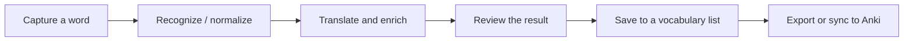

<div align="center">

# Wortshatzer

**Capture words while you read, watch, or study — understand them, save them, and move them into Anki without breaking focus.**

[](https://github.com/MAliD0/Wortshatzer-Releases/releases/latest)
[](https://github.com/MAliD0/Wortshatzer-Releases/releases/latest)
[](LICENSE)

[**Download the latest release**](https://github.com/MAliD0/Wortshatzer-Releases/releases/latest) · [User guide](docs/USER_GUIDE.md)

</div>

Wortshatzer is a Windows desktop vocabulary companion built for language learning. It can capture text from the screen or clipboard, resolve useful dictionary information, keep vocabulary in local lists, and export or synchronize cards with Anki.

The current language workflows focus on **German** and **Japanese**, while the application architecture keeps language and provider behavior configurable.

## At a glance

| Capture | Understand | Learn |
| --- | --- | --- |
| Screen-region OCR | Dictionary and lexical enrichment | Local vocabulary lists |
| Clipboard capture | German canonical forms and morphology | Editable saved entries |
| Manual input | Japanese kana / kanji normalization | Configurable Anki fields |
| Global shortcuts | Reverso / dictionary / optional DeepL workflows | TSV export and AnkiConnect sync |

## Typical workflow



1. Select a word on screen with the OCR shortcut, capture clipboard text, or type it manually.
2. Wortshatzer resolves the useful learning form and enriches it with dictionary information.
3. Review the translation, forms, examples, and other available fields.
4. Save the word into a local vocabulary list.
5. Export the list or synchronize configured cards with Anki.

## Features

### Capture without leaving what you are doing

- Windows screen-region OCR with the default `Ctrl + Shift + O` shortcut.
- Clipboard and manual-input capture.
- Floating translation popup designed for quick review and save actions.
- Configurable shortcuts and desktop behavior.

### German and Japanese learning workflows

- German canonical-form and morphology support through Verbformen-backed workflows.
- Japanese romaji, kana, and kanji normalization with lexical lookup support.
- Structured dictionary senses, examples, and language-specific fields.
- Reverso translation/fallback and contextual examples.
- Optional DeepL translation when configured.
- Configurable dictionary fallback chains and scraper profiles.

### Vocabulary and Anki

- Local SQLite vocabulary lists.
- Captured, canonical, and learning forms kept with saved vocabulary where available.
- Edit saved entries and refresh information from the configured source.
- Configure which dictionary and learning fields are used for cards.
- Configure card direction, tags, duplicate behavior, and presentation.
- Export Anki-ready TSV files.
- Explicit AnkiConnect synchronization.

### Desktop experience

- Runs as a normal Windows desktop application with tray support.
- Optional close-to-tray and launch-at-sign-in behavior.
- Single-instance handling prevents duplicate tray/hotkey/database ownership.
- Light, Dark, and System themes with optional user color overrides.
- Application data is stored separately from the install directory.

## Install

### Recommended

Open the [latest release](https://github.com/MAliD0/Wortshatzer-Releases/releases/latest) and download:

**`Wortshatzer-Installer.exe`**

The installer lets you choose the application directory while keeping user data in a separate safe location.

### Other packages

Depending on how you want to install or run Wortshatzer, releases may also contain:

- `Wortshatzer-win-Setup.exe`
- `Wortshatzer-win.msi`
- `Wortshatzer-win-Portable.zip`

For normal use, the interactive `Wortshatzer-Installer.exe` is the recommended option.

## Quick start

1. Install and launch Wortshatzer.
2. Choose the source and target languages you want to use.
3. Open any text, webpage, document, or video with readable subtitles.
4. Press `Ctrl + Shift + O` and select a word or short phrase.
5. Review the popup result and save the word to your vocabulary list.
6. Open **Vocabulary** when you want to review, edit, export, or sync saved material.

See the [full user guide](docs/USER_GUIDE.md) for capture methods, Anki setup, desktop behavior, and troubleshooting.

## Data location

Persistent user data is stored outside the application installation directory:

```text
%LOCALAPPDATA%\Wortshatzer.UserData
```

Changing or updating the application installation should therefore not replace the vocabulary database and normal user settings stored there.

## Repository purpose

This public repository hosts **Wortshatzer Windows releases and user-facing documentation**.

For downloads, always use the [Releases page](https://github.com/MAliD0/Wortshatzer-Releases/releases).

<!--
Screenshot gallery plan for a future docs pass:
- docs/images/main-window.png
- docs/images/capture-popup.png
- docs/images/vocabulary.png
- docs/images/anki-settings.png
Use screenshots from an actual public Windows build rather than mockups.
-->
